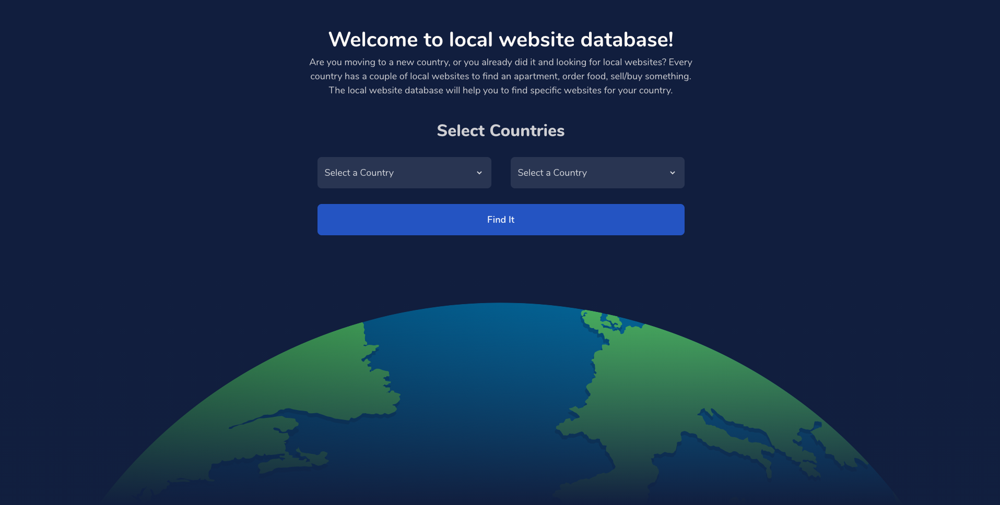

# The local website database
We are living in different countries with different languages, but around the world, every state has at least one local websites for;

* Find an Apartment
* Order Food
* Buy/Sell Car
* Buy/Sell House
* Buy/Sell Second-hand Furniture

The local website database will help you to find specific websites for your country.



If you want to better understanding structural logic, those PRs would be helpful;
1. [First Set-up](https://github.com/volcanioo/local-websites/pull/1)
2. [Data Structure Updates](https://github.com/volcanioo/local-websites/pull/2)
3. [Modal Management](https://github.com/volcanioo/local-websites/pull/4)

# What We Have
We currently support 3 different countries;

* Turkey `100%`
* Germany `35%`
* Brasil `50%`

> We still need more Germany and Brasil websites! If you need more detail about the list/categories let me know!

Do you want to add your country? Let's check [How can I add another country](#how-can-I-add-another-country)!

# Project Set-up
Install all dependencies
```
npm install
```

Run project;
``` 
npm start
```

# How can I add another country?
1. Create a new branch from `develop` branch
2. Create a JSON file in `data/countries/` directory. (You can find a dummy json in this directory, you can copy it!)
3. Add an import in `countries.js` file.
4. Test it locally
5. Create a PR then you are pretty set! 🎉  

# Licence
[MIT](https://github.com/volcanioo/local-websites/blob/master/LICENSE)
